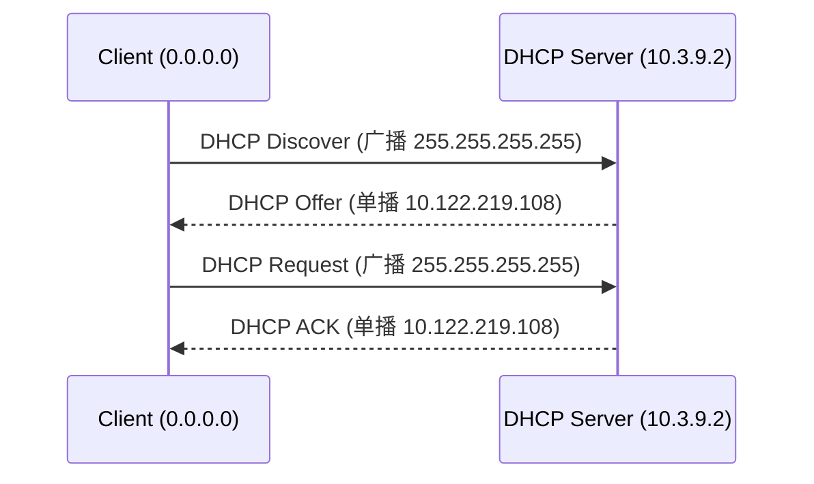

# DHCP 协议分析

> 抓包文件：`captures/dhcp/dhcp-dora.pcapng`（`ipconfig /release` + `ipconfig /renew`）

## 1. DHCP 功能简述

DHCP（Dynamic Host Configuration Protocol）动态主机配置协议，客户端无需手工配置即可从服务器获取 IP 地址、子网掩码、默认网关、DNS 服务器及租约时间等参数。

## 2. DORA 四阶段

Transaction ID 均为 **0x348015F3** 的四个包（帧 2–5）：

| 阶段 | 报文类型 | 源地址 | 目的地址 | 主要作用 |
|---|---|---|---|---|
| 1 | DHCP Discover | 0.0.0.0 | 255.255.255.255 | 客户端广播寻找服务器 |
| 2 | DHCP Offer | 10.3.9.2 | 10.122.219.108 | 服务器单播提供 IP 提议 |
| 3 | DHCP Request | 0.0.0.0 | 255.255.255.255 | 客户端广播请求使用该 IP |
| 4 | DHCP ACK | 10.3.9.2 | 10.122.219.108 | 服务器单播确认分配 |

> 帧 1 为 DHCP Release（Transaction ID `0x9F16ECB3`），属于 `/release` 操作，不属于本次 DORA 流程。

## 3. DHCP ACK 配置参数（帧 5）

| 参数 | Option | 捕获值 | 含义 |
|---|---|---|---|
| Your IP Address | — | 10.122.219.108 | 分配给客户端的 IP |
| Subnet Mask | 1 | 255.255.192.0 | 子网掩码 |
| Router | 3 | 10.122.192.1 | 默认网关 |
| Domain Name Server | 6 | 10.3.9.5, 10.3.9.4, 10.3.9.6 | 校园网 DNS 服务器 |
| IP Address Lease Time | 51 | 3600（1 小时） | 租约时间 |
| DHCP Server Identifier | 54 | 10.3.9.2 | DHCP 服务器标识 |

## 4. 服务器角色判断

- **DHCP 服务器**为 `10.3.9.2`（Option 54），**不是**默认网关 `10.122.192.1`。
- 网关 `10.122.192.1` 仅作为 Option 3（Router）下发，由路由器转发流量，但 DHCP 服务由校园网专用服务器 `10.3.9.2` 提供。
- 抓包中 **giaddr 均为 0.0.0.0**，客户端与服务器在同一广播域直接通信，**无 DHCP Relay**。

## 5. DHCP 消息序列图

见 `diagrams/dhcp-sequence.mmd`。

